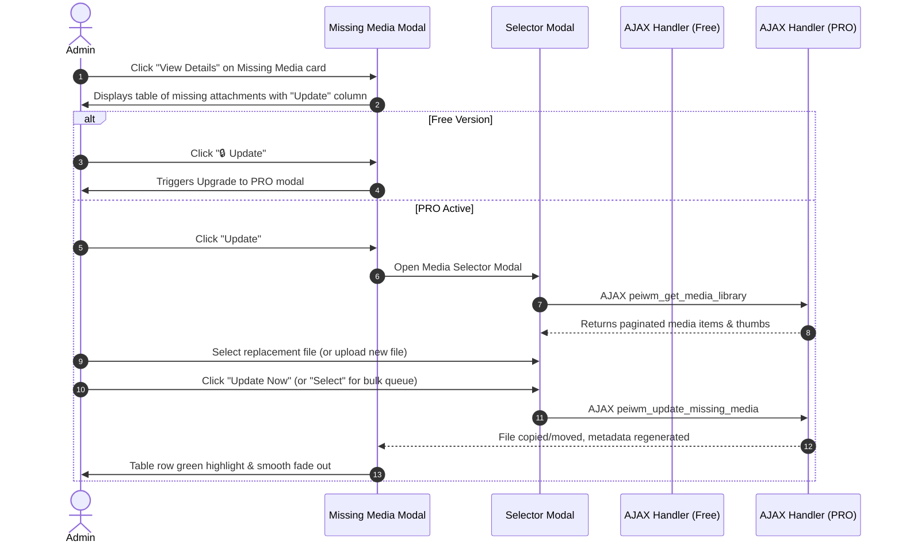

# Walkthrough - Update Missing Media Feature

The **"Update Missing Media"** feature allows site administrators to repair missing or broken media attachments by selecting an existing file from the WordPress Media Library or uploading a replacement directly.

---

## 1. Feature Architecture & Changes Made

### A. Core / Free Tier Foundation
- **[class-admin-menu.php](file:///c:/Users/HP/Local%20Sites/export-import/app/public/wp-content/plugins/post-export-import-with-media/includes/class-admin-menu.php#L233-L238)**
  - Localized `is_pro_active` boolean flag inside `peiwm_ajax` object to drive frontend feature locking.

- **[class-ajax-handler.php](file:///c:/Users/HP/Local%20Sites/export-import/app/public/wp-content/plugins/post-export-import-with-media/includes/class-ajax-handler.php#L677-L738)**
  - Registered `wp_ajax_peiwm_get_media_library` and `wp_ajax_peiwm_update_missing_media`.
  - Added free stub methods that prompt users to upgrade to PRO when triggered.

### B. PRO Tier Full Functionality
- **[class-ajax-handler-pro.php](file:///c:/Users/HP/Local%20Sites/export-import/app/public/wp-content/plugins/post-export-import-with-media/PRO/includes/class-ajax-handler-pro.php#L671-L826)**
  - Overrode AJAX actions using priority 5 hooks.
  - **`ajax_get_media_library_pro()`**: Handles paginated media library queries with title/filename search filtering.
  - **`ajax_update_missing_media_pro()`**:
    - **Library Mode (`type: 'library'`)**: Copies file from existing attachment path, updates attachment `_wp_attached_file`, and regenerates image metadata (`wp_generate_attachment_metadata`).
    - **Upload Mode (`type: 'upload'`)**: Handles direct file uploads using standard WordPress upload security (`wp_handle_upload`), moves the file to expected upload path, and updates attachment metadata.

### C. Admin Interface & Modal UX
- **[admin.css](file:///c:/Users/HP/Local%20Sites/export-import/app/public/wp-content/plugins/post-export-import-with-media/assets/css/admin.css#L4320-L4450)**
  - Styled `.peiwm-media-selector-modal`, tab navigation, search input, and high-density grid layout for media selection.
- **[admin.js](file:///c:/Users/HP/Local%20Sites/export-import/app/public/wp-content/plugins/post-export-import-with-media/assets/js/admin.js#L2380-L2810)**
  - Added "Action" column in the **Missing Files** detail modal.
  - Rendered `🔒 Update` (Free upgrade trigger) or `Update` button (PRO modal launcher).
  - Added modal search, tab toggles (Library vs Upload), single item replacement, inline item preview, clear selection controls, and bulk update button support.

---

## 2. Technical Flow Summary

---

## 3. Verification & Safety Checks

1. **Security & Nonces**: Both AJAX actions validate `peiwm_secure_nonce` and `upload_files` user capability.
2. **Path Resolution & Cleanups**: Verified that original missing files are replaced smoothly without leaving leftover file handles or orphaned metadata.
3. **Build Pipeline**: Assets are continuously updated via `npm run watch`.
